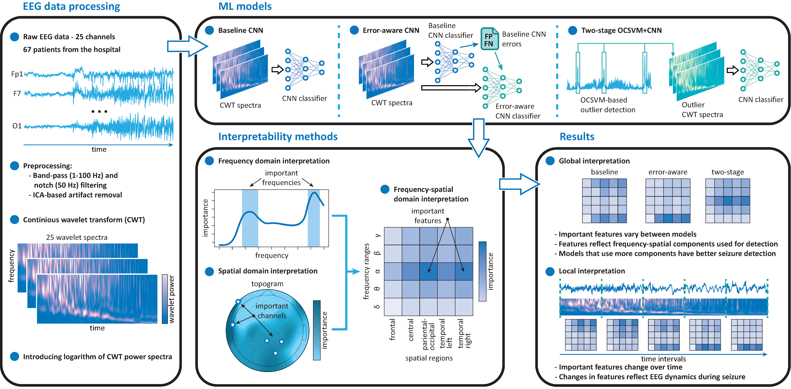
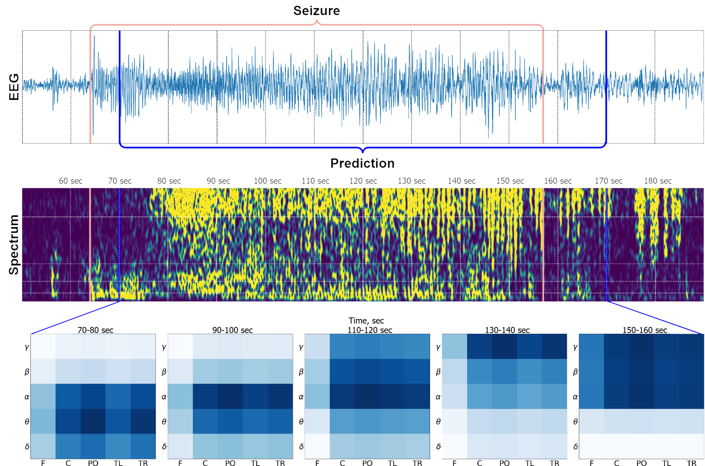

## A Novel Interpretability Framework for CNN-Based EEG Analysis: Uncovering Spatial and Spectral Biomarkers of Epileptic Seizures

Python implementation for interpretability methods intorduced in the paper
* Spatial region importance
* Frequency range importance
* Frequency-spatial interpretation

`main.py` contains snippet code to obtain extended version of local interpretation which depends on private EEG recordings (contact us to receive the materials)
